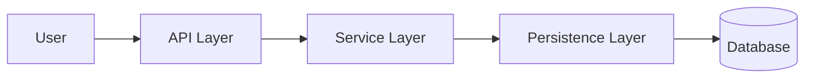

# Example Output

## Architecture Summary

The repository contains API, service, persistence, and data components.

## Component Diagram

## Incremental Delta

- Added files: 2
- Modified files: 1
- Removed files: 0
- Unchanged files reused from cache: 80

## Recommendations

- Validate generated diagrams with maintainers.
- Keep generated docs under `docs/generated/`.
- Keep hand-written docs outside generated folders.