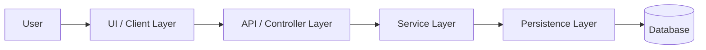
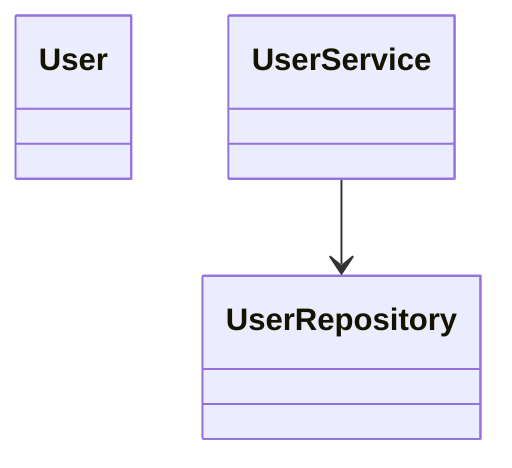
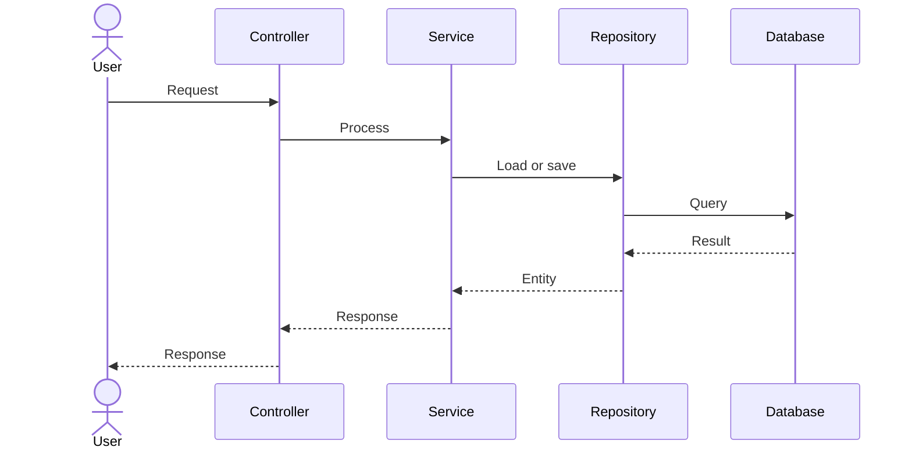
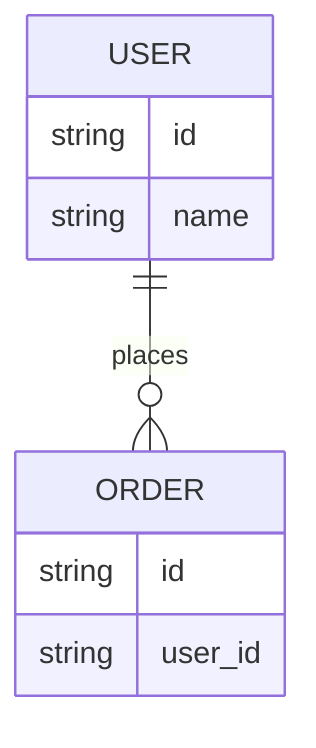

# Diagram Guidance

## Component Diagram

Use for high-level architecture.

## Class Diagram

Use for classes, interfaces, inheritance, and simple relationships.

## Sequence Diagram

Use for request or workflow behavior.

## ER Diagram

Use for SQL, Prisma, ORM entities, and schema relationships.

