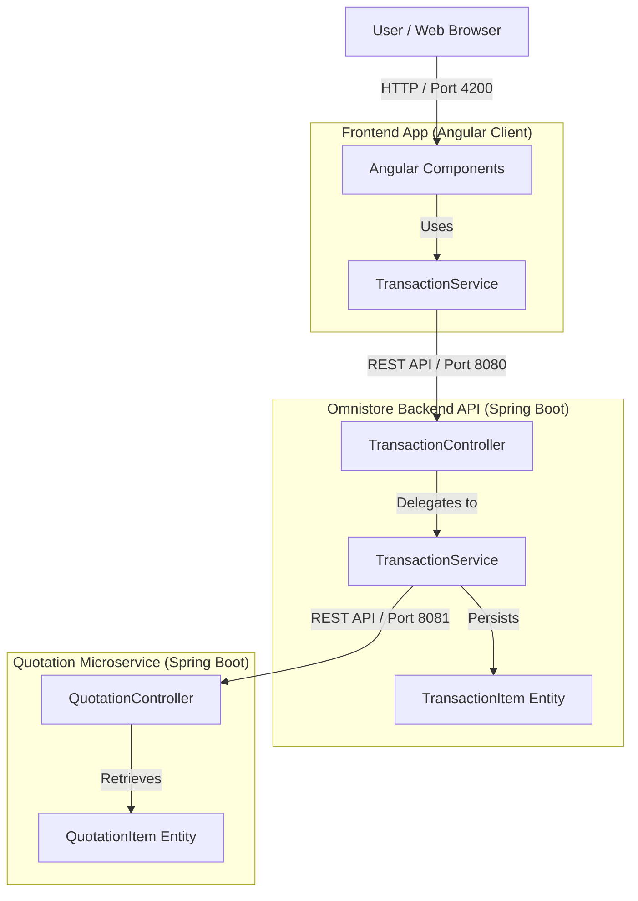

# Mock Omnistore UI & Quotation API

A full-stack application demonstrating a simulated retail/omnichannel checkout interface with real-time price synchronization from a microservice (Quotation API).

## 🚀 Project Overview

The project consists of three main components:
1. **Frontend (`frontend/`)**: An Angular-based user interface for scanning/adding items and completing transactions.
2. **Omnistore Backend (`backend/`)**: A Spring Boot application managing the active transaction, inventory database, and business logic.
3. **Quotation API (`Quotation/`)**: A Spring Boot microservice providing quotation rates for products, simulating an external pricing engine.

---

## 🛠️ Architecture & Price Sync Flow

Price synchronization with the Quotation API is on-demand to optimize performance:
- **Trigger**: Happens **only** when a user adds a new item to the cart or updates an item's quantity.
- **Behavior**: The Omnistore backend queries the Quotation API for the latest rate and updates the local cart item.
- **Fallback**: If the Quotation API is unreachable, the backend gracefully falls back to the locally cached prices.

---

## 📋 Prerequisites

Before running the application, ensure you have the following installed:
- **Java 17+** (available on your `PATH`)
- **Node.js 18+** & npm
- **PostgreSQL** running locally on port `5432`
- *Note: Maven is pre-bundled in the project at `apache-maven-3.9.6/`.*

---

## ⚙️ Setup & Installation

### 1. Database Configuration
Open your PostgreSQL client and run the following queries to create the databases:
```sql
CREATE DATABASE omnistore;
CREATE DATABASE quotation;
```

> ⚙️ **Database Credentials**
> Both services connect using the following credentials configured in their respective `application.properties`:
> - **Username**: `postgres`
> - **Password**: `ayushdey`
>
> If your credentials differ, update the configuration files in:
> - `backend/src/main/resources/application.properties`
> - `Quotation/src/main/resources/application.properties`

### 2. Quick Start - Run All Components (Recommended)
You can run all components automatically using the provided startup scripts. These will validate your environment, run `npm install` if necessary, and launch each component in its own separate window.

*   **Using Command Prompt / Double-click:**
    ```cmd
    start-all.bat
    ```
*   **Using PowerShell:**
    ```powershell
    .\start-all.ps1
    ```

---

### 3. Manual Start: Quotation API (Port 8081)
Open a terminal in the project root directory and run:
```bash
cd Quotation
..\apache-maven-3.9.6\bin\mvn spring-boot:run
```
*Verify it is running by visiting [http://localhost:8081/api/quotation](http://localhost:8081/api/quotation) (should return a JSON array of 6 products).*

### 4. Manual Start: Omnistore Backend (Port 8080)
Open a new terminal window in the project root directory and run:
```bash
cd backend
..\apache-maven-3.9.6\bin\mvn spring-boot:run
```
*Verify it is running by visiting [http://localhost:8080/api/products](http://localhost:8080/api/products).*

### 5. Manual Start: Frontend App (Port 4200)
Open a new terminal window in the project root directory and run:
```bash
cd frontend
npm install   # Only required on first startup
npm start
```
*Open your browser and navigate to [http://localhost:4200](http://localhost:4200).*

---

## 🔄 Startup Order Summary

| Order | Service | Port | Directory | Command |
| :---: | :--- | :---: | :--- | :--- |
| **1** | **Quotation API** | `8081` | `Quotation/` | `..\apache-maven-3.9.6\bin\mvn spring-boot:run` |
| **2** | **Omnistore Backend** | `8080` | `backend/` | `..\apache-maven-3.9.6\bin\mvn spring-boot:run` |
| **3** | **Angular Frontend** | `4200` | `frontend/` | `npm start` |

---

## 🧪 Testing Price Sync

To make testing repeatable, database seeders reset prices back to baseline on startup:
- **Backend Startup**: Resets local prices to baseline (lower rates).
- **Quotation API Startup**: Resets quotation rates to correct (higher rates).

### Test Flow:
1. Open the UI at [http://localhost:4200](http://localhost:4200).
2. Observe **CLE MEULEUSE WOLFCRAFT** in the cart (starts at **€13.00**). Adjust its quantity to see it sync to **€14.50** from the Quotation API.
3. Try scanning or searching for any of these barcodes to add new products and witness instant price sync:

| Barcode | Product Name | Baseline Price | Synced (Quotation) Price |
| :--- | :--- | :---: | :---: |
| `0088381612036` | SCIE CIRCULAIRE MAKITA 1200W | €99.90 | **€109.99** |
| `3165140829120` | MEULEUSE D'ANGLE BOSCH PROFESSIONAL | €45.00 | **€49.90** |
| `8004828014524` | POSTE A SOUDER DECA I-ARC 120 | €119.00 | **€129.50** |
| `3148517894236` | COFFRET DE DOUILLES FACOM 38PCS | €149.00 | **€159.99** |
| `3253561771370` | NIVEAU LASER ROTATIF STANLEY FATMAX | €229.00 | **€245.00** |
| `4054278120364` | NETTOYEUR HAUTE PRESSION KARCHER K4 | €189.90 | **€199.99** |
| `3760015907421` | COMPRESSEUR BICYLINDRE MICHELIN 50L | €159.00 | **€175.00** |
| `3276007123985` | ETABLI D'ATELIER EN BOIS DEXTER | €89.00 | **€99.00** |
| `4054278049689` | ASPIRATEUR DE CHANTIER KARCHER WD3 | €69.90 | **€74.90** |
| `3276000702453` | PROJECTEUR DE CHANTIER LED DEXTER | €19.90 | **€24.90** |

---

## 🏃 Running Tests

You can run unit and integration tests for each project layer:

```bash
# Test Quotation API
cd Quotation
..\apache-maven-3.9.6\bin\mvn test

# Test Omnistore Backend
cd backend
..\apache-maven-3.9.6\bin\mvn test

# Test Frontend
cd frontend
npm test
```

---

## 🛠️ Troubleshooting

| Issue | Root Cause & Resolution |
| :--- | :--- |
| **`Connection refused` on 5432** | Ensure PostgreSQL local service is started. |
| **Database does not exist** | Verify you created `omnistore` and `quotation` databases. |
| **Port already in use** | Find and kill the process using port `8080`, `8081`, or `4200`, or reconfigure ports in `application.properties`. |
| **Quotation API Offline** | Backend will log a fallback warning and continue using the cached database price. |
| **CORS / Frontend API errors** | Verify backend is running on port `8080`. |

<!-- ARCHITECTURE-DOCS:START -->
## 🗺️ Architecture & Developer Navigation

This repository is organized as a multi-service application containing an **Angular frontend client**, a **Spring Boot Backend API**, and a **Spring Boot Quotation Microservice**. 

### 🚀 Where to Start?
* **First Time Here?** Read the [Developer Onboarding Guide](docs/generated/onboarding.md) to set up the project and run tests.
* **Want to understand the code structure?** Review the [System Overview](docs/generated/system-overview.md) to see how modules, routes, and entities map.
* **Architectural Review?** Check the [Architecture Review](docs/generated/architecture-review.md) for code quality indicators and coupling analyses.

---

### 📂 Repository Documentation Index

| Component / Document | Description | Key Reference Diagrams |
| :--- | :--- | :--- |
| 📄 [Architecture Overview](docs/generated/architecture.md) | High-level system goals, technologies & stacks | 🗺️ [UML Component Diagram](docs/generated/diagrams/component-diagram.md) |
| 📄 [System Overview](docs/generated/system-overview.md) | Discovered codebase modules, API endpoints & schemas | 🔄 [UML Sequence Diagram](docs/generated/diagrams/sequence-diagrams.md) |
| 📄 [Components & Classes](docs/generated/components.md) | Full catalog of identified classes and methods | 🏷️ [UML Class Diagram Index](docs/generated/diagrams/class-diagram.md) |
| 📄 [API Reference](docs/generated/api-reference.md) | Dynamic list of REST endpoint routing details | 🗄️ [UML ER Diagram](docs/generated/diagrams/er-diagram.md) |
| 📄 [Onboarding Guide](docs/generated/onboarding.md) | Local environment startup and testing commands | |
| 📄 [Architecture Review](docs/generated/architecture-review.md) | Large classes list, coupling warnings & recommendations | |

---

### 🗺️ High-Level Component Flow



<details>
<summary><b>🔍 System Metrics & Stats</b></summary>

* **Discovered Modules:** 46 (Java, TypeScript, Python)
* **Discovered Classes:** 39
* **API Endpoints:** 17
* **Database Entities:** 6
* **Relationships / Couplings:** 7
* **Codebase Language Mix:** Java (32 file(s)), TypeScript (7 file(s))

_Last incremental analysis scan on 46 changed files._
</details>

> This section is auto-managed. Do not edit between the architecture documentation markers manually.
<!-- ARCHITECTURE-DOCS:END -->

