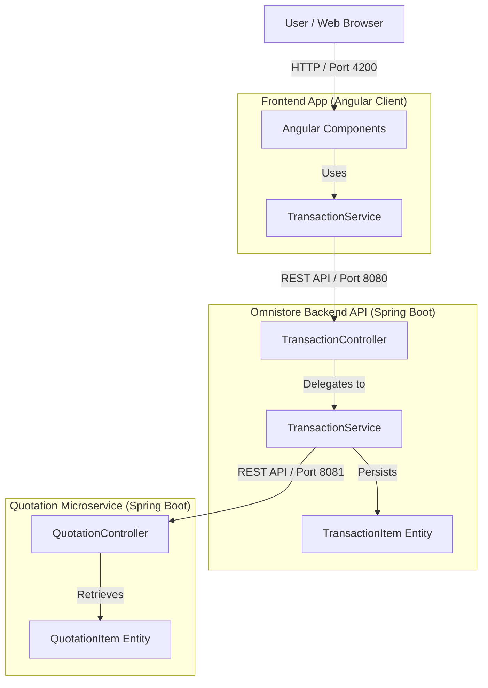

# Architecture Overview

## Purpose

This document summarizes the architecture discovered through incremental static analysis.

## Incremental Analysis Summary

- Added files: 46
- Modified files: 0
- Removed files: 0
- Unchanged files reused from cache: 0

## Repository Summary

- Modules discovered: 46
- Classes discovered: 39
- API routes discovered: 17
- Entities discovered: 6
- Relationships discovered: 7
- Dependencies discovered: 15

## Technology Stack

### Languages

- Java: 32
- TypeScript: 7

### Build and Dependency Files

- `backend/pom.xml`: `pom.xml`
- `frontend/package.json`: `package.json`
- `Quotation/pom.xml`: `pom.xml`

## High-Level Architecture

## Assumptions

- This documentation is generated from static analysis.
- Runtime dependency injection, reflection, dynamic imports, and generated code may require manual review.

## Recommendations

- Review diagrams with maintainers.
- Keep generated docs under `docs/generated/`.
- Keep human-authored docs separately, for example under `docs/adr/`.
