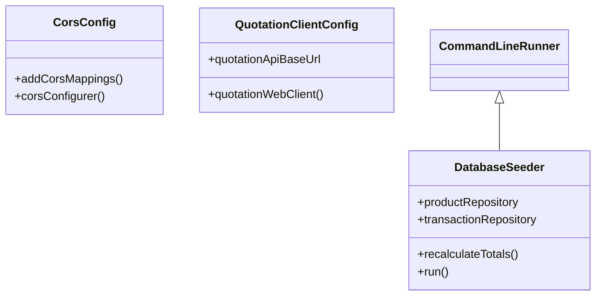

# Class Diagram - Backend Configurations

```mermaid
classDiagram
    class CorsConfig
    class CorsConfig {
        +addCorsMappings()
        +corsConfigurer()
    }
    class DatabaseSeeder
    class DatabaseSeeder {
        +productRepository
        +transactionRepository
        +recalculateTotals()
        +run()
    }
    class QuotationClientConfig
    class QuotationClientConfig {
        +quotationApiBaseUrl
        +quotationWebClient()
    }
    CommandLineRunner <|-- DatabaseSeeder
```
