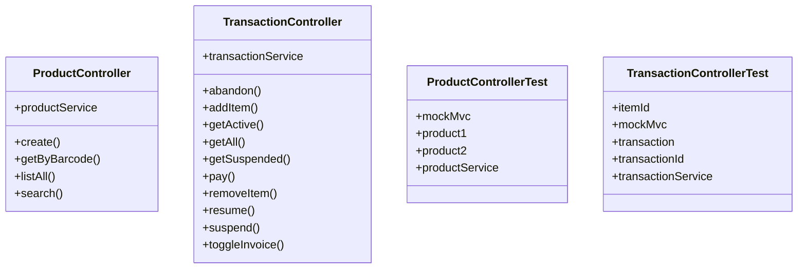

# Class Diagram - Backend Controllers (REST Endpoints)

```mermaid
classDiagram
    class ProductController
    class ProductController {
        +productService
        +create()
        +getByBarcode()
        +listAll()
        +search()
    }
    class TransactionController
    class TransactionController {
        +transactionService
        +abandon()
        +addItem()
        +getActive()
        +getAll()
        +getSuspended()
        +pay()
        +removeItem()
        +resume()
        +suspend()
        +toggleInvoice()
    }
    class ProductControllerTest
    class ProductControllerTest {
        +mockMvc
        +product1
        +product2
        +productService
    }
    class TransactionControllerTest
    class TransactionControllerTest {
        +itemId
        +mockMvc
        +transaction
        +transactionId
        +transactionService
    }
```
