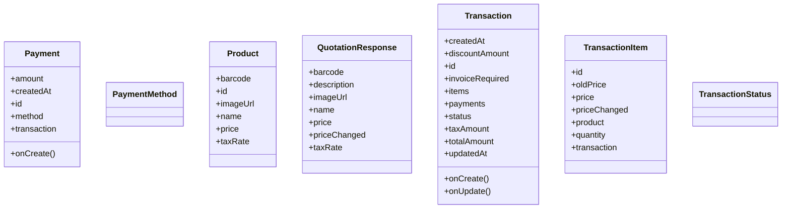

# Class Diagram - Backend Entities & Models (Data Layer)

```mermaid
classDiagram
    class Payment
    class Payment {
        +amount
        +createdAt
        +id
        +method
        +transaction
        +onCreate()
    }
    class PaymentMethod
    class Product
    class Product {
        +barcode
        +id
        +imageUrl
        +name
        +price
        +taxRate
    }
    class QuotationResponse
    class QuotationResponse {
        +barcode
        +description
        +imageUrl
        +name
        +price
        +priceChanged
        +taxRate
    }
    class Transaction
    class Transaction {
        +createdAt
        +discountAmount
        +id
        +invoiceRequired
        +items
        +payments
        +status
        +taxAmount
        +totalAmount
        +updatedAt
        +onCreate()
        +onUpdate()
    }
    class TransactionItem
    class TransactionItem {
        +id
        +oldPrice
        +price
        +priceChanged
        +product
        +quantity
        +transaction
    }
    class TransactionStatus
```
