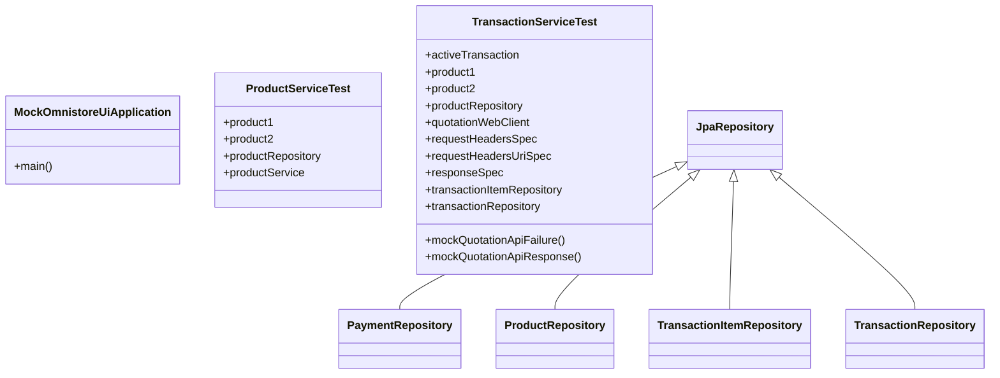

# Class Diagram - Backend Other Components

```mermaid
classDiagram
    class MockOmnistoreUiApplication
    class MockOmnistoreUiApplication {
        +main()
    }
    class PaymentRepository
    class ProductRepository
    class TransactionItemRepository
    class TransactionRepository
    class ProductServiceTest
    class ProductServiceTest {
        +product1
        +product2
        +productRepository
        +productService
    }
    class TransactionServiceTest
    class TransactionServiceTest {
        +activeTransaction
        +product1
        +product2
        +productRepository
        +quotationWebClient
        +requestHeadersSpec
        +requestHeadersUriSpec
        +responseSpec
        +transactionItemRepository
        +transactionRepository
        +mockQuotationApiFailure()
        +mockQuotationApiResponse()
    }
    JpaRepository <|-- PaymentRepository
    JpaRepository <|-- ProductRepository
    JpaRepository <|-- TransactionItemRepository
    JpaRepository <|-- TransactionRepository
```
