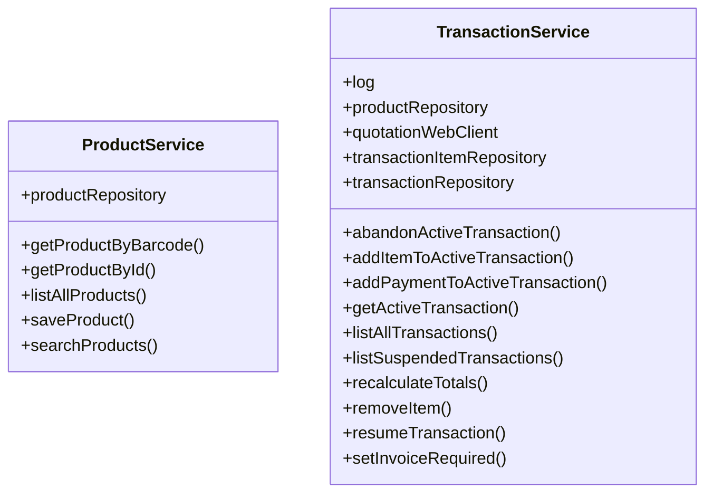

# Class Diagram - Backend Services (Business Logic)

```mermaid
classDiagram
    class ProductService
    class ProductService {
        +productRepository
        +getProductByBarcode()
        +getProductById()
        +listAllProducts()
        +saveProduct()
        +searchProducts()
    }
    class TransactionService
    class TransactionService {
        +log
        +productRepository
        +quotationWebClient
        +transactionItemRepository
        +transactionRepository
        +abandonActiveTransaction()
        +addItemToActiveTransaction()
        +addPaymentToActiveTransaction()
        +getActiveTransaction()
        +listAllTransactions()
        +listSuspendedTransactions()
        +recalculateTotals()
        +removeItem()
        +resumeTransaction()
        +setInvoiceRequired()
    }
```
