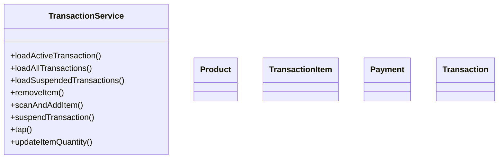

# Class Diagram - Frontend Services (Angular API client)

```mermaid
classDiagram
    class TransactionService
    class TransactionService {
        +loadActiveTransaction()
        +loadAllTransactions()
        +loadSuspendedTransactions()
        +removeItem()
        +scanAndAddItem()
        +suspendTransaction()
        +tap()
        +updateItemQuantity()
    }
    class Product
    class TransactionItem
    class Payment
    class Transaction
```
