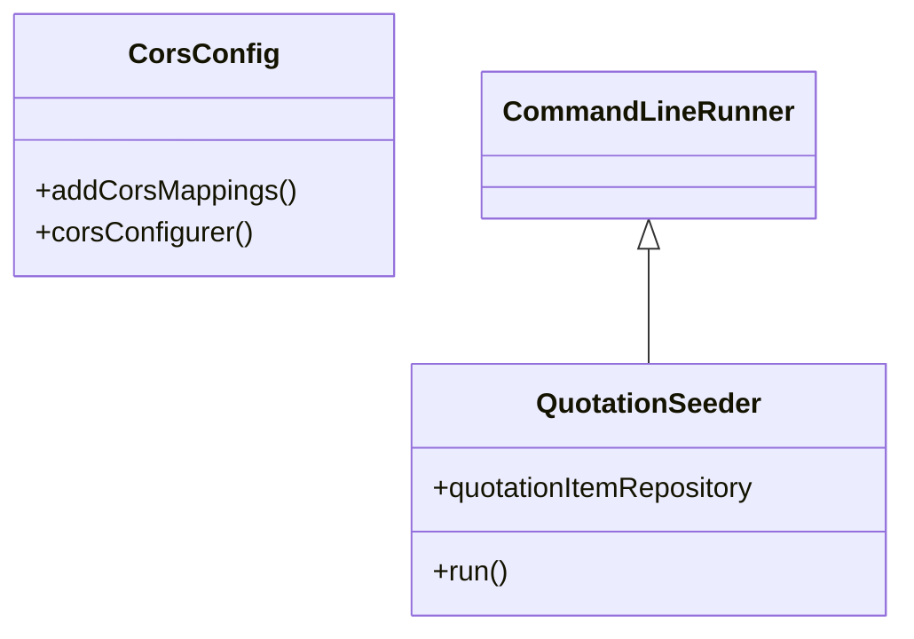

# Class Diagram - Quotation Configurations

```mermaid
classDiagram
    class CorsConfig
    class CorsConfig {
        +addCorsMappings()
        +corsConfigurer()
    }
    class QuotationSeeder
    class QuotationSeeder {
        +quotationItemRepository
        +run()
    }
    CommandLineRunner <|-- QuotationSeeder
```
