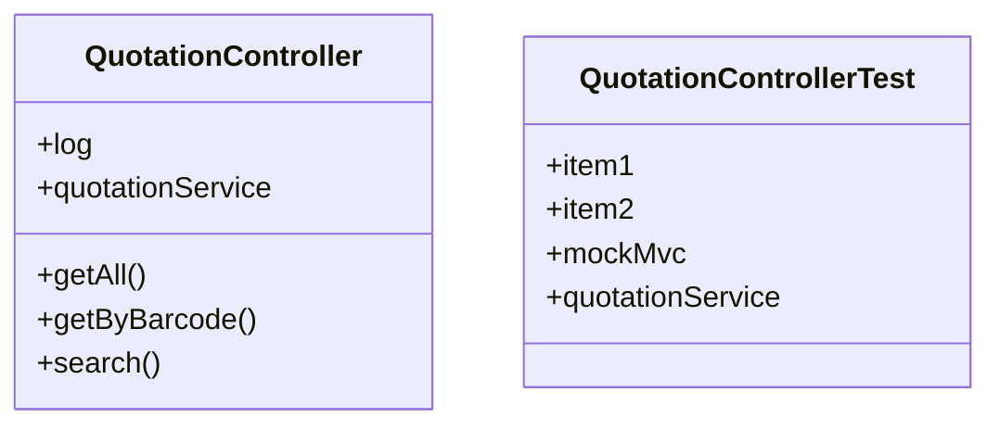

# Class Diagram - Quotation Controllers (REST Endpoints)

```mermaid
classDiagram
    class QuotationController
    class QuotationController {
        +log
        +quotationService
        +getAll()
        +getByBarcode()
        +search()
    }
    class QuotationControllerTest
    class QuotationControllerTest {
        +item1
        +item2
        +mockMvc
        +quotationService
    }
```
