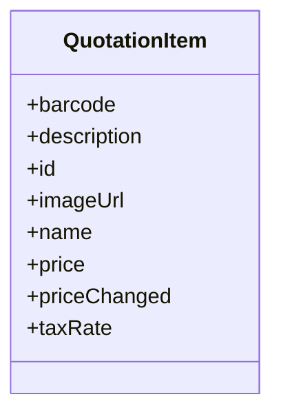

# Class Diagram - Quotation Entities & Models (Data Layer)

```mermaid
classDiagram
    class QuotationItem
    class QuotationItem {
        +barcode
        +description
        +id
        +imageUrl
        +name
        +price
        +priceChanged
        +taxRate
    }
```
