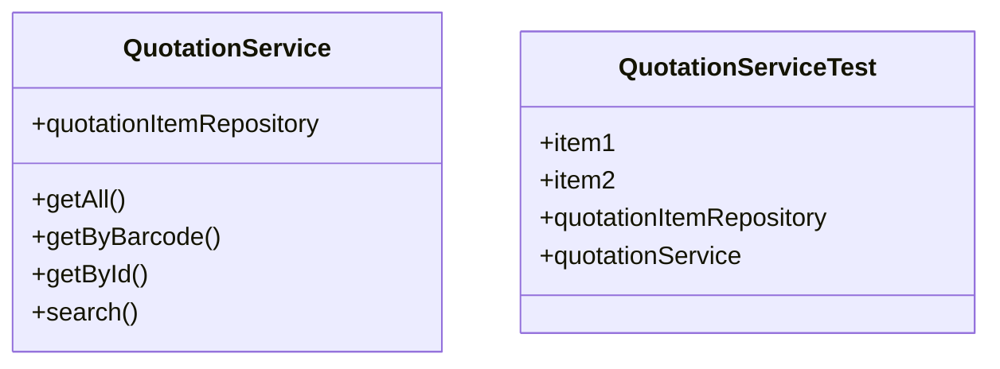

# Class Diagram - Quotation Services (Lookup Logic)

```mermaid
classDiagram
    class QuotationService
    class QuotationService {
        +quotationItemRepository
        +getAll()
        +getByBarcode()
        +getById()
        +search()
    }
    class QuotationServiceTest
    class QuotationServiceTest {
        +item1
        +item2
        +quotationItemRepository
        +quotationService
    }
```
