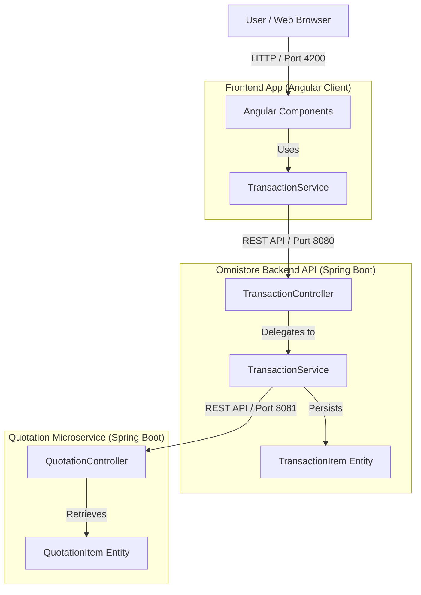

# Component Diagram

```mermaid
flowchart TD
    User["User / Web Browser"]

    subgraph Frontend["Frontend App (Angular Client)"]
        UI["Angular Components"]
        ServiceJS["TransactionService"]
    end

    subgraph Backend["Omnistore Backend API (Spring Boot)"]
        TransController["TransactionController"]
        TransService["TransactionService"]
        TransItem["TransactionItem Entity"]
    end

    subgraph QuotationService["Quotation Microservice (Spring Boot)"]
        QuoteController["QuotationController"]
        QuoteItem["QuotationItem Entity"]
    end

    User -->|HTTP / Port 4200| UI
    UI -->|Uses| ServiceJS
    ServiceJS -->|REST API / Port 8080| TransController
    TransController -->|Delegates to| TransService
    TransService -->|REST API / Port 8081| QuoteController
    TransService -->|Persists| TransItem
    QuoteController -->|Retrieves| QuoteItem
```
