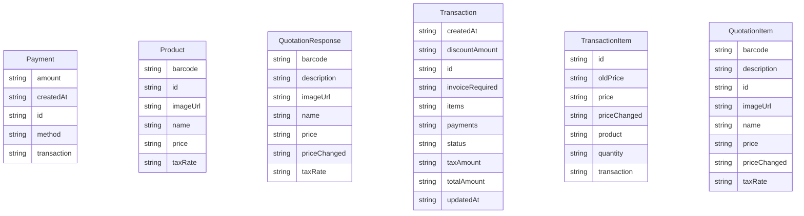

# ER Diagram

```mermaid
erDiagram
    Payment {
        string amount
        string createdAt
        string id
        string method
        string transaction
    }
    Product {
        string barcode
        string id
        string imageUrl
        string name
        string price
        string taxRate
    }
    QuotationResponse {
        string barcode
        string description
        string imageUrl
        string name
        string price
        string priceChanged
        string taxRate
    }
    Transaction {
        string createdAt
        string discountAmount
        string id
        string invoiceRequired
        string items
        string payments
        string status
        string taxAmount
        string totalAmount
        string updatedAt
    }
    TransactionItem {
        string id
        string oldPrice
        string price
        string priceChanged
        string product
        string quantity
        string transaction
    }
    QuotationItem {
        string barcode
        string description
        string id
        string imageUrl
        string name
        string price
        string priceChanged
        string taxRate
    }
```
