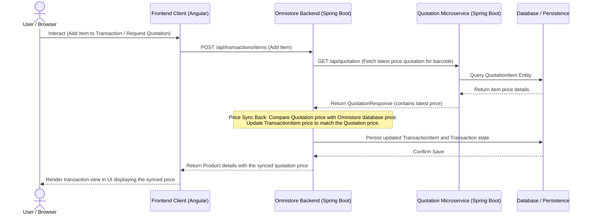

# Sequence Diagram

```mermaid
sequenceDiagram
    actor User as User / Browser
    participant FE as Frontend Client (Angular)
    participant BE as Omnistore Backend (Spring Boot)
    participant QS as Quotation Microservice (Spring Boot)
    participant DB as Database / Persistence

    User->>FE: Interact (Add Item to Transaction / Request Quotation)
    FE->>BE: POST /api/transactions/items (Add Item)
    BE->>QS: GET /api/quotation (Fetch latest price quotation for barcode)
    QS->>DB: Query QuotationItem Entity
    DB-->>QS: Return item price details
    QS-->>BE: Return QuotationResponse (contains latest price)
    Note over BE: Price Sync Back: Compare Quotation price with Omnistore database price.<br/>Update TransactionItem price to match the Quotation price.
    BE->>DB: Persist updated TransactionItem and Transaction state
    DB-->>BE: Confirm Save
    BE-->>FE: Return Product details with the synced quotation price
    FE-->>User: Render transaction view in UI displaying the synced price
```
